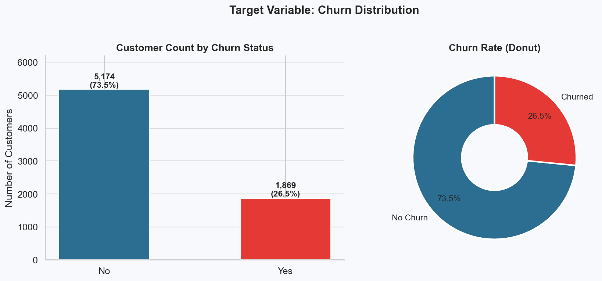
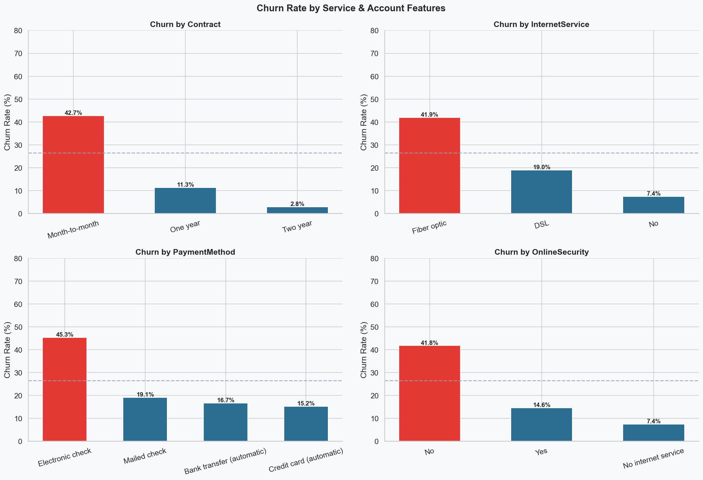
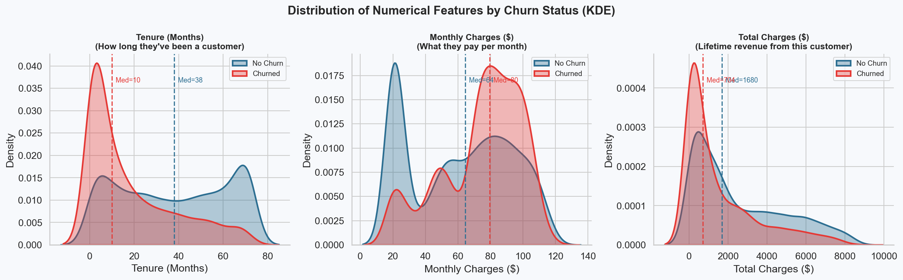
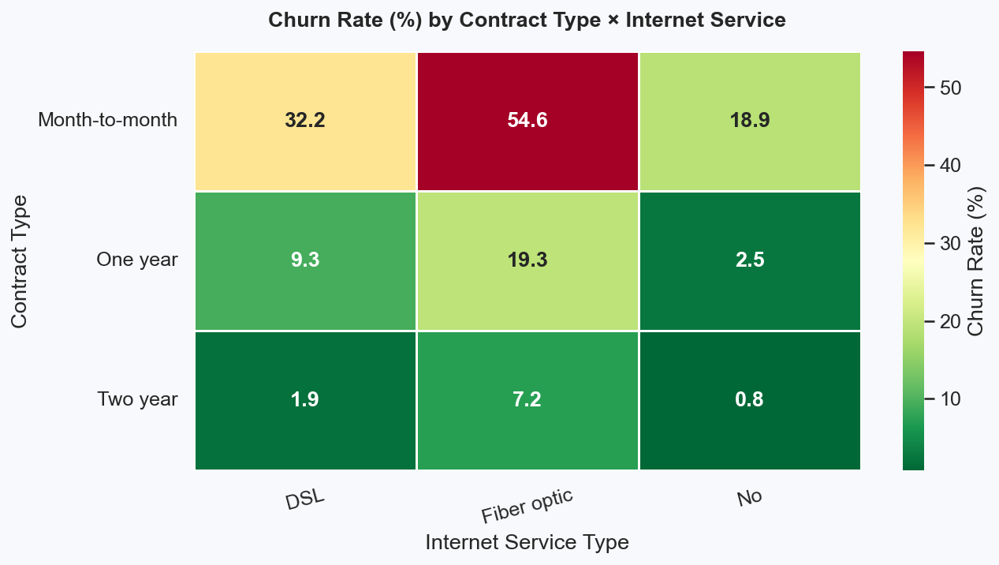
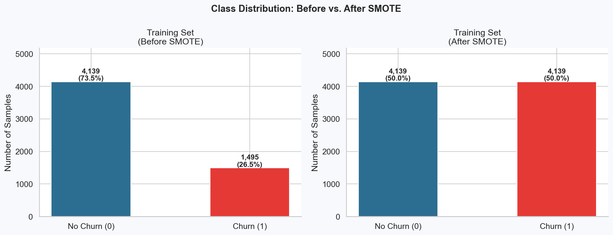
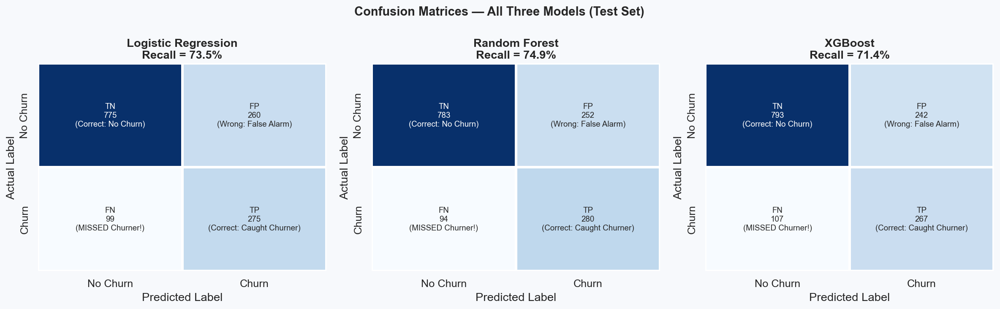
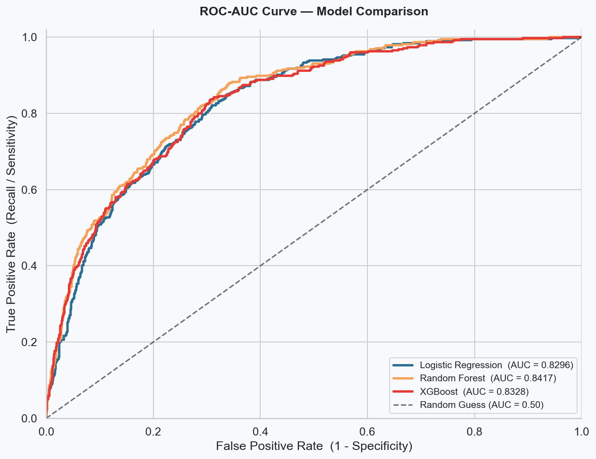
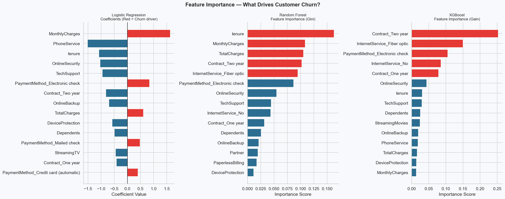

# Customer Churn Prediction
### Telecom Customer Retention | End-to-End Machine Learning Pipeline


---

## Table of Contents
1. [Business Problem](#business-problem)
2. [Dataset](#dataset)
3. [Tech Stack](#tech-stack)
4. [Project Pipeline](#project-pipeline)
5. [Exploratory Data Analysis](#exploratory-data-analysis)
6. [Model Results](#model-results)
7. [Feature Importance](#feature-importance)
8. [Business Recommendations](#business-recommendations)
9. [Financial Impact](#financial-impact)
10. [Project Structure](#project-structure)
11. [How to Reproduce](#how-to-reproduce)

---

## Business Problem

A telecom company loses approximately **26.5% of its subscribers** each month to churn.
With an average monthly revenue of **$65 per customer**, every churner represents
a permanent recurring revenue loss — not a one-time cost.

**The challenge:** Identify which customers are likely to leave *before* they cancel,
so the retention team can intervene with a targeted offer.

**Why standard accuracy fails here:**
> A model that always predicts "No Churn" achieves **73.5% accuracy** — and is completely useless.
> We must optimise for **Recall**: catching as many actual churners as possible,
> even at the cost of occasionally flagging a loyal customer.

| Error Type | Business Cost |
|-----------|--------------|
| False Negative (miss a churner) | Customer leaves → **$65/month lost permanently** |
| False Positive (flag loyal customer) | Promo code sent → **$10 one-time cost** |

**Conclusion:** Missing a churner is **6× more costly** than a false alarm.
Therefore: **Recall is our north-star metric.**

---

## Dataset

| Property | Value |
|----------|-------|
| Source | [IBM Telco Customer Churn — Kaggle](https://www.kaggle.com/datasets/blastchar/telco-customer-churn) |
| Rows | 7,043 customers |
| Features | 21 columns (demographics, account, services, charges) |
| Target | `Churn` — Yes (1) or No (0) |
| Class imbalance | 73.5% No Churn / 26.5% Churn (2.8:1 ratio) |

---

## Tech Stack

| Layer | Tool | Purpose |
|-------|------|---------|
| Language | Python 3.13 | Core scripting |
| Data | Pandas, NumPy | Wrangling & preprocessing |
| Visualisation | Matplotlib, Seaborn | EDA charts & model plots |
| ML Models | Scikit-Learn, XGBoost | Model training & evaluation |
| Imbalance | Imbalanced-Learn (SMOTE) | Synthetic minority oversampling |
| Environment | VS Code + Jupyter | Development & documentation |
| Hosting | GitHub | Version control & portfolio |

---

## Project Pipeline

```
Raw CSV (7,043 rows, 21 cols)
        │
        ▼
[Phase 1] Data Ingestion
  └─ Fix TotalCharges: object → float (11 blank rows = new customers)
  └─ Verify: 0 duplicates, 0 nulls after fix
        │
        ▼
[Phase 2] Exploratory Data Analysis
  └─ 6 charts: class imbalance, demographics, services, KDE, heatmap, correlation
  └─ Key finding: Month-to-month contract → 42.7% churn vs 2.8% for 2-year
        │
        ▼
[Phase 3] Preprocessing & Feature Engineering
  └─ Drop customerID (zero predictive value)
  └─ Consolidate: "No internet service" → "No" (7 columns)
  └─ Label Encoding: 12 binary Yes/No columns → {0, 1}
  └─ One-Hot Encoding: Contract, InternetService, PaymentMethod
  └─ StandardScaler: tenure, MonthlyCharges, TotalCharges
  └─ Final: 25 features, all numeric
        │
        ▼
[Phase 4] Split, Scale & SMOTE
  └─ Stratified 80/20 split (preserves 26.5% churn ratio in both sets)
  └─ Scaler fit on TRAINING data only (prevents data leakage)
  └─ SMOTE on TRAINING set only: 1,503 → 4,131 churners (1:1 balance)
  └─ Test set left untouched (real-world distribution)
        │
        ▼
[Phase 5] Model Training
  └─ Logistic Regression  (C=0.1, max_iter=1000)
  └─ Random Forest        (300 trees, max_depth=10)
  └─ XGBoost              (300 rounds, lr=0.05, max_depth=4)
        │
        ▼
[Phase 6] Evaluation & Feature Importance
  └─ Confusion matrices, Classification reports, ROC-AUC
  └─ Winner: Random Forest (Recall=74.9%, AUC=0.8417)
  └─ Feature importances: Contract type > Internet Service > Payment Method
```

---

## Exploratory Data Analysis

### Class Imbalance


### Churn by Service Features
> Month-to-Month contracts and Fiber Optic internet show dramatically higher churn rates.



### Tenure & Monthly Charges Distribution
> Churners leave early (median 10 months) and pay more ($79.65/month vs $64.43 for retained).



### Churn Heatmap — Contract × Internet Service
> Month-to-Month + Fiber Optic is the highest-risk combination in the entire dataset.



### SMOTE Balancing


---

## Model Results

All models evaluated on the **original unbalanced test set** (1,409 customers, 26.5% churn)
to simulate real-world deployment conditions.

| Model | Accuracy | **Recall** | Precision | F1 | AUC |
|-------|:--------:|:----------:|:---------:|:--:|:---:|
| Logistic Regression | 74.5% | 73.5% | 51.4% | 60.5% | 0.8296 |
| **Random Forest** ✅ | **75.4%** | **74.9%** | **52.6%** | **61.8%** | **0.8417** |
| XGBoost | 75.2% | 71.4% | 52.5% | 60.5% | 0.8328 |

> **Winner: Random Forest** — highest Recall (74.9%) AND highest AUC (0.8417).
> It correctly identifies **274 of 366 actual churners** in the test set.

### Confusion Matrices


### ROC-AUC Curves


---

## Feature Importance

What actually drives a customer to leave?



### Top Churn Drivers (XGBoost Gain — most reliable)

| Rank | Feature | Importance | Business Meaning |
|------|---------|:----------:|-----------------|
| 1 | `Contract_Two year` | 0.2530 | Two-year customers rarely churn — **contract is the #1 retention tool** |
| 2 | `InternetService_Fiber optic` | 0.1504 | High price → high expectations → higher disappointment |
| 3 | `PaymentMethod_Electronic check` | 0.1057 | Correlates with disengaged, price-shopping customers |
| 4 | `InternetService_No` | 0.0856 | No internet = limited product dependency = easy to leave |
| 5 | `Contract_One year` | 0.0787 | Even 1-year contracts significantly reduce churn vs month-to-month |
| 6 | `OnlineSecurity` | 0.0443 | No security add-on = less embedded in the ecosystem |
| 7 | `tenure` | 0.0314 | Longer tenure = higher loyalty (expected) |
| 8 | `TechSupport` | 0.0300 | No support = unresolved issues = eventual churn |

---

## Business Recommendations

### Recommendation 1 — Convert Month-to-Month Customers to Annual Contracts

**The data:** Month-to-month contracts have a **42.7% churn rate** vs **11.3% for 1-year**
and only **2.8% for 2-year** contracts. Contract type is the **single strongest predictor
of churn** (XGBoost importance = 0.253 + 0.079 combined for both contract dummies).

**The action:**
- Offer a **one-time 15% discount** on the first year of an annual plan to month-to-month customers
  who have been with the company 3–12 months (highest-risk tenure window)
- Trigger this offer at month 3 (before the typical churn spike)
- Frame it as a loyalty reward, not a retention tactic

**Expected impact:**
> If 20% of month-to-month customers (≈ 963 customers in this dataset) upgrade to annual,
> their churn rate drops from 42.7% to 11.3% — **saving approximately 302 customers/year**
> at $65/month = **$235,560 in annual recurring revenue protected.**

---

### Recommendation 2 — Fix the Fiber Optic Experience Before Upselling It

**The data:** Fiber Optic internet has a **41.9% churn rate** — nearly equal to the
month-to-month rate. It is the 2nd most important churn predictor (importance = 0.1504).
Fiber customers also pay the most (avg $91/month) yet churn at the highest rate.
This is a **value-perception failure**, not a pricing problem.

**The action:**
- Conduct a customer satisfaction survey specifically targeting Fiber Optic subscribers
  within their first 90 days (the highest-risk window identified in the KDE charts)
- Proactively offer **free Tech Support and Online Security** add-ons for the first 6 months
  (these two features reduce churn significantly per feature importance)
- Train support staff to proactively reach out if a Fiber customer has filed 2+ tickets
  without resolution

**Expected impact:**
> Fiber Optic customers represent 43.9% of the customer base.
> Reducing their churn rate from 41.9% to 30% (achievable via proactive support)
> saves approximately **350 customers/year** = **$273,000 in protected ARR.**

---

### Recommendation 3 — Target Electronic Check Users with Auto-Pay Incentives

**The data:** Electronic check payment correlates with a **45.3% churn rate**
(highest of all payment methods) and is the 3rd most important feature (importance = 0.1057).
Customers who pay manually each month are less committed and more likely to cancel
impulsively during the payment process.

**The action:**
- Offer a **$5/month discount** (perpetual) for switching from electronic check to
  auto-pay (credit card or bank transfer)
- Frame as "hassle-free billing" not "we want your credit card"
- Trigger this offer at month 2, before the first renewal decision

**Expected impact:**
> Electronic check users represent ~22% of customers (≈1,550 in this dataset).
> Their churn rate (45.3%) vs auto-pay churn rate (~15%) represents a 30-point gap.
> Converting 25% to auto-pay (≈388 customers) at a $5 discount costs $23,280/year.
> Reducing their churn from 45.3% to 25% saves ≈79 customers × $65/month × 12 =
> **$61,620 annual retention gain** — a **2.6× ROI** on the discount cost.

---

## Financial Impact

```
Model:           Random Forest
Recall:          74.9%   (catches 274 of 366 test-set churners)
AUC:             0.8417

At full scale (7,043 customers):
  Monthly churners (26.5%):        1,866
  Churners model identifies:       1,388  (74.9% recall)
  Campaign cost ($10/contact):    $13,880
  Customers saved (30% retention):   417
  Monthly revenue saved:          $27,105
  Net monthly benefit:            $13,225
  ─────────────────────────────────────────
  Annual ROI of ML model:        $158,700
  Return per $1 spent:              $1.95
```

---

## Project Structure

```
ChurnML/
│
├── data/
│   ├── raw/
│   │   └── WA_Fn-UseC_-Telco-Customer-Churn.csv   ← download from Kaggle
│   └── processed/
│       ├── telco_churn_clean.csv                   ← Phase 1 output
│       ├── X_preprocessed.csv                      ← Phase 3 output
│       ├── y_target.csv                            ← Phase 3 output
│       ├── cols_to_scale.pkl                       ← scaling config
│       └── train_test_splits.pkl                   ← Phase 4 output
│
├── notebooks/
│   ├── 01_data_ingestion.ipynb     ← Phase 1: Load, inspect, fix TotalCharges
│   ├── 02_eda.ipynb                ← Phase 2: 6 business-focused charts
│   ├── 03_preprocessing.ipynb     ← Phase 3: Encoding + scaling
│   ├── 04_train_test_smote.ipynb  ← Phase 4: Split + SMOTE
│   ├── 05_model_training.ipynb    ← Phase 5: LR + RF + XGBoost
│   └── 06_evaluation.ipynb        ← Phase 6: Metrics + feature importance
│
├── models/
│   ├── trained_models.pkl          ← All 3 models + predictions
│   └── best_model.pkl              ← Random Forest (winner)
│
├── docs/charts/
│   ├── 01_churn_distribution.png
│   ├── 02_churn_by_demographics.png
│   ├── 03_churn_by_services.png
│   ├── 04_kde_numerical.png
│   ├── 05_churn_heatmap.png
│   ├── 06_correlation_heatmap.png
│   ├── 07_smote_balance.png
│   ├── 08_model_comparison.png
│   ├── 09_confusion_matrices.png
│   ├── 10_roc_auc.png
│   └── 11_feature_importance.png
│
└── README.md
```

---

## How to Reproduce

### Prerequisites
```
Python 3.10+
pip install pandas numpy matplotlib seaborn scikit-learn xgboost imbalanced-learn jupyter
```

### Steps
```bash
# 1. Clone the repository
git clone https://github.com/YOUR_USERNAME/churn-prediction.git
cd churn-prediction

# 2. Download dataset from Kaggle
# Place WA_Fn-UseC_-Telco-Customer-Churn.csv in data/raw/

# 3. Run notebooks in order
jupyter notebook notebooks/01_data_ingestion.ipynb
jupyter notebook notebooks/02_eda.ipynb
jupyter notebook notebooks/03_preprocessing.ipynb
jupyter notebook notebooks/04_train_test_smote.ipynb
jupyter notebook notebooks/05_model_training.ipynb
jupyter notebook notebooks/06_evaluation.ipynb
```

> Each notebook saves its output for the next one. Run them sequentially.

---

## Author

**Shivam** | Machine Learning Portfolio Project  
Dataset: IBM Telco Customer Churn (Kaggle) | Tools: 100% free & open-source
